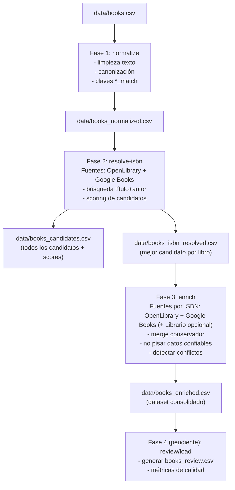

# Diagrama del pipeline ETL

```mermaid
flowchart TD
    A["data/books.csv"] --> B["Fase 1: normalize<br/>- limpieza texto<br/>- canonización<br/>- claves *_match"]
    B --> C["data/books_normalized.csv"]

    C --> D["Fase 2: resolve-isbn<br/>Fuentes: OpenLibrary + Google Books<br/>- búsqueda título+autor<br/>- scoring de candidatos"]
    D --> E["data/books_candidates.csv<br/>(todos los candidatos + scores)"]
    D --> F["data/books_isbn_resolved.csv<br/>(mejor candidato por libro)"]

    F --> G["Fase 3: enrich<br/>Fuentes por ISBN: OpenLibrary + Google Books (+ Librario opcional)<br/>- merge conservador<br/>- no pisar datos confiables<br/>- detectar conflictos"]
    G --> H["data/books_enriched.csv<br/>(dataset consolidado)"]

    H --> I["Fase 4 (pendiente): review/load<br/>- generar books_review.csv<br/>- métricas de calidad"]
```

